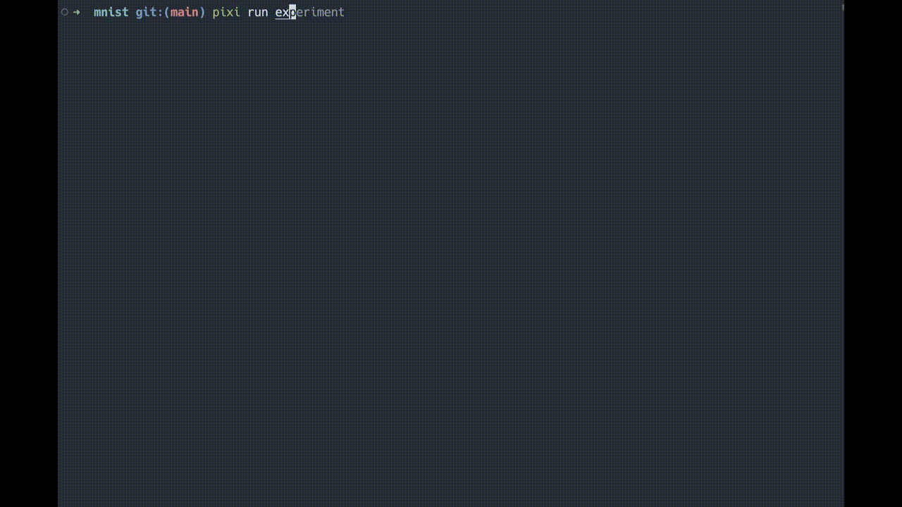
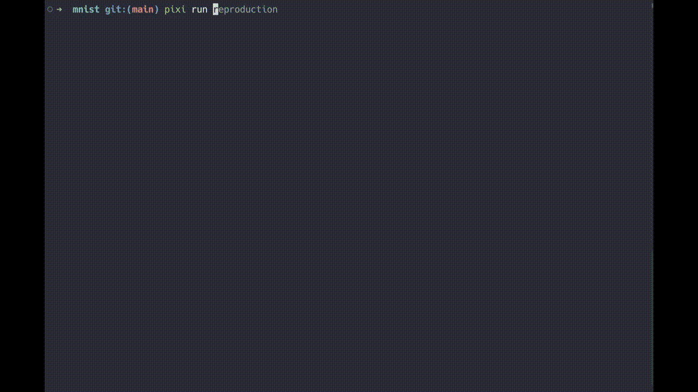

# CRESP - Computational Research Environment Standardization Protocol

CRESP is a toolkit for standardizing and validating reproducibility of computational scientific experiments. This project aims to address reproducibility issues in computational science experiments and help researchers without programming expertise conduct computational research.

## Features

### Experiment Demo
```bash
cd examples/mnist
pixi run experiment
```


### Reproduction Demo
```bash
cd examples/mnist
pixi run reproduction
```


- Provides standardized configuration schemes for describing computational experiment environments and workflows
- Automatically records and validates outputs at each stage of the experiment
- Three validation levels:
  - `strict`: All output file hashes must match exactly
  - `standard`: Key results must match but allows differences in non-critical outputs; fixed random seeds but tolerates platform differences
  - `tolerant`: Results are acceptable within specified ranges
- Lowers technical barriers for researchers to implement reproducible experiments
- Integrates with existing tools (like Pixi)

## Installation

```bash
pip install cresp
```

## Usage

```bash
cresp --help
```

## Development Roadmap

### Phase 1: Core Module

- Workflow Management (`core/workflow.py`)
  - [x] Stage definition and validation
  - [x] Stage dependency resolution
  - [x] Stage execution tracking

- Configuration Management (`core/config.py`)
  - [x] YAML-based configuration schema
  - [x] Environment validation
  - [x] Path management

- Validation Modes (`core/validation`)
  - [x] Strict validation (`core/validation/strict.py`)
  - [ ] Standard validation (`core/validation/standard.py`)
  - [ ] Tolerant validation (`core/validation/tolerant.py`)
  - [ ] Output data save and comparison (`core/validation/standard.py` & `core/validation/tolerant.py`)

- Random Seed Management (`core/seed.py`)
  - [x] Global seed control
  - [x] Per-stage seed management
  - [x] Framework-specific seed handling

### Phase 2: Functional Modules

- Stage Management (`core/stage.py`)
  - [x] Stage definition and validation
  - [x] Stage dependency resolution 
  - [x] Stage execution tracking

- Validation Logic (core/validation.py)
  - [ ] Multi-level validation strategies
  - [ ] Output comparison
  - [ ] Tolerance handling

### Phase 3: Public API

- [ ] Package Initialization (__init__.py)
- [ ] Public Function Exposure
- [ ] API Documentation

### Phase 4: CLI Interface

- [ ] Basic Command Structure
- Subcommand Implementation
  - [ ] init
  - [ ] validate
  - [ ] run
  - [ ] report

### Phase 5: Extended Features

- Report Generation
  - [ ] HTML reports
  - [ ] Markdown reports
  - [ ] Validation summaries

- Tool Integration
  - [ ] Pixi integration
  - [ ] Git integration
  - [ ] CI/CD support
